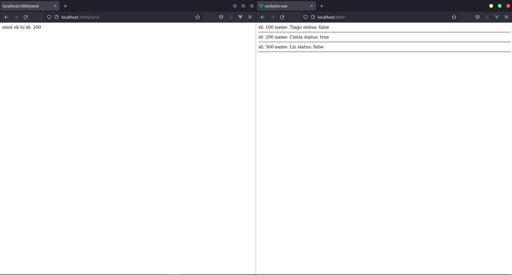

# Socketio com VueJs

## Recursos utilizados

-   Socket.io
-   Node/Express & NestJs
-   JWT para validação da comunicação
-   Middleware para barrar uma comunicação inválida
-   Criação de uma biblioteca com padrão de projeto observer

## Bibliotecas utilizadas

### Frontend/VueJs

-   jsonwebtoken ^8.5.1
-   socket.io-client ^4.1.2

### Api/NodeJs

-   socket.io ^0.2.0
-   jsonwebtoken ^8.5.1

### Api/NestJs

-   platform-express ^9.0.0
-   @nestjs/websockets ^9.1.6
-   @nestjs/websockets ^9.1.6
-   @nestjs/jwt ^9.0.0
-   passport-jwt ^4.0.0

## Como clonar e rodar o projeto

## Clonar o repositório

```bash
git clone https://github.com/venzel/socketio_vuejs_nodejs.git
```

### Rodar o frontend VueJs

```bash
cd frontend-vue

yarn serve
```

### Rodar a API do NodeJs

```bash
cd api-node

node index.js
```

### Rodar a API do NestJs

```bash
cd api-nest

yarn start:dev
```

## Como observar a interação entre a API e o Frontend

Rode os dois projetos: api e frontend.

Dica: abra 2 navegadores e coloque um ao lado do outro.



No segundo navegador, acesse o frontend: http://localhost:8080 e observe o estado original do objeto:

```js
// Objeto original
users: [
    { id: 100, name: 'Tiago', status: false },
    { id: 200, name: 'Cíntia', status: false },
    { id: 300, name: 'Liz', status: false },
],
```

Agora, no primeiro navegador, acesse o endpoint da api: http://localhost:3000/users

Observe na tela 2 (dois) do frontend, que o segundo objeto foi alterado: { id: 200, name: 'Cíntia', status: true }

```js
// Objeto modificado no front, quando o endpoint http://localhost:3000/users acessado
users: [
    { id: 100, name: 'Tiago', status: false },
    { id: 200, name: 'Cíntia', status: true },
    { id: 300, name: 'Liz', status: false },
],
```
